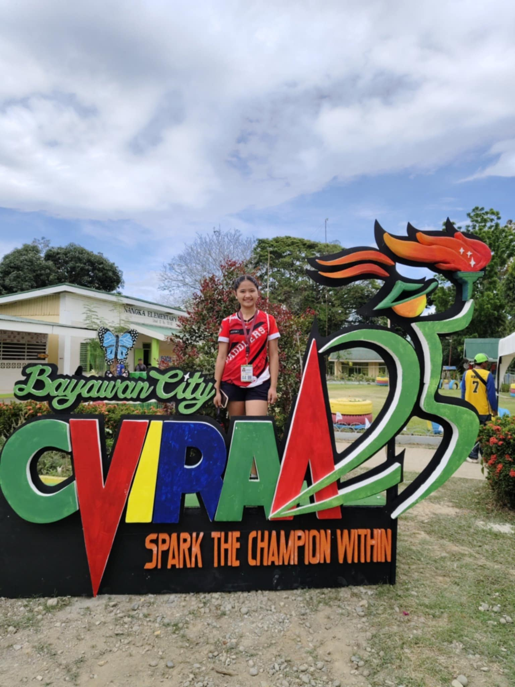
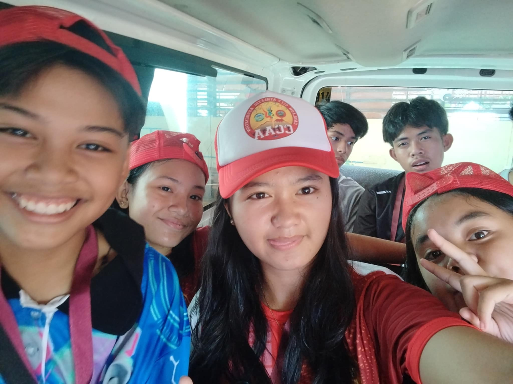
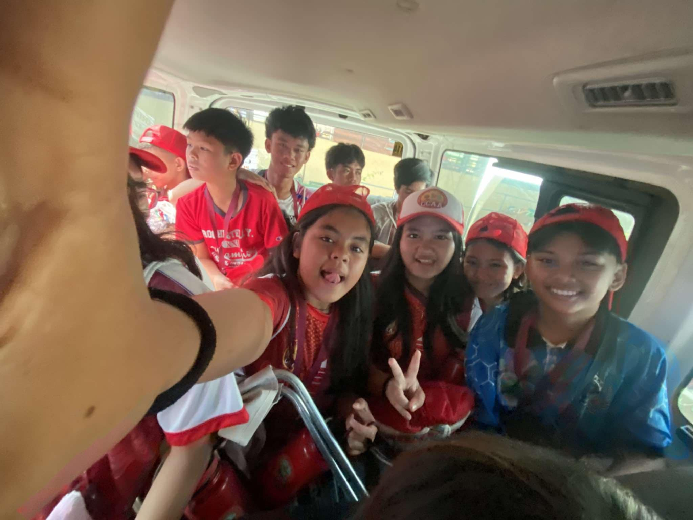
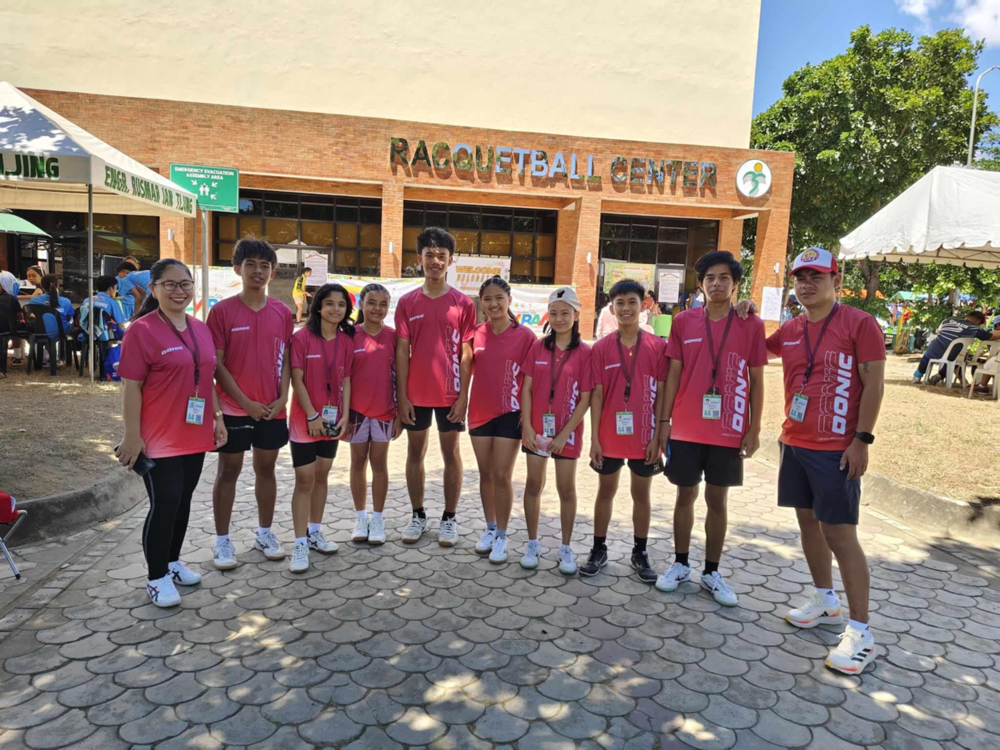
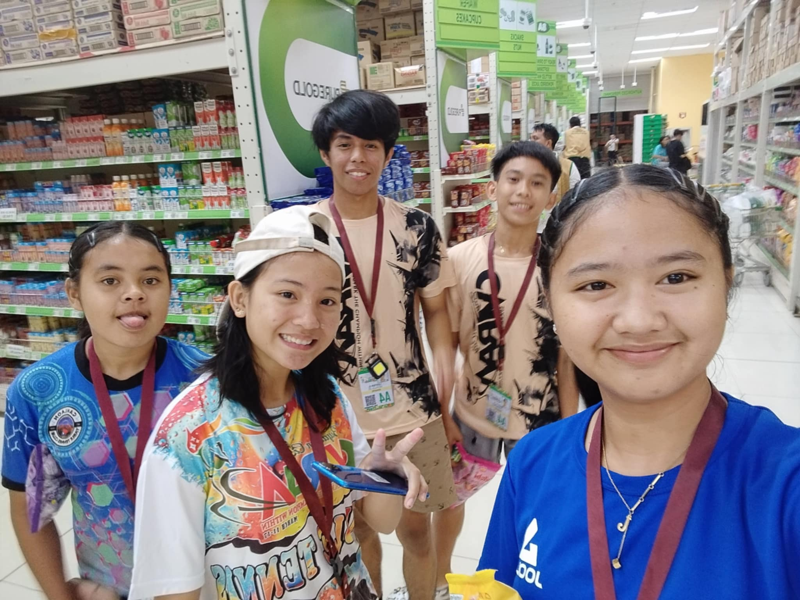
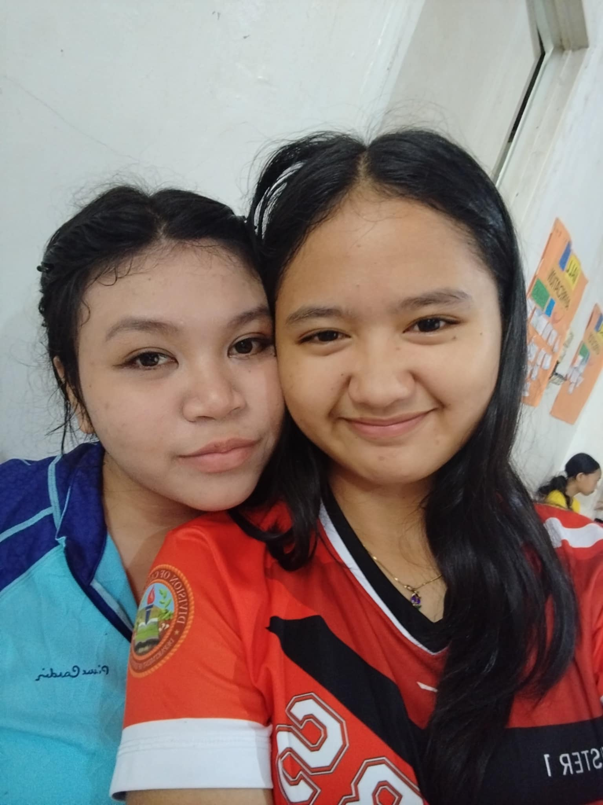
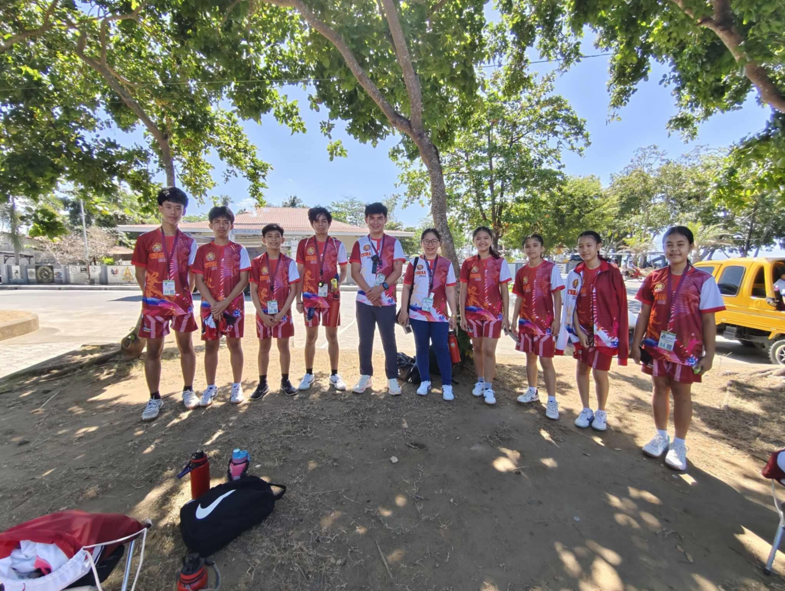
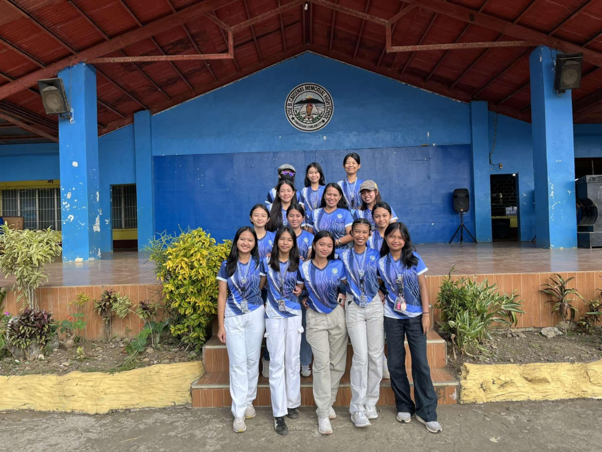

# alyzakHate.github.io
<html>

<body>

  <h1>My Image Gallery</h1>

      
  Hello, I am Alyza Khate S. Hijara  from Grade 10 Einstein. This is my output for the image gallery project. I concentrated on making sure the photographs were structured correctly and shown on the page in a clear and orderly manner.  These pictures capture happy, passionate, and determined moments and are really motivating.

  <!-- Images displayed at the center -->

  
  
  
  
  
  
 
 

 
 

</body>
</html>
