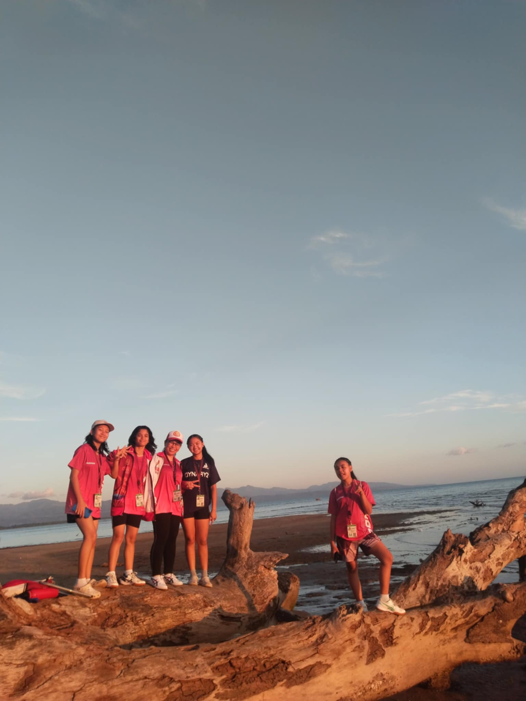

<html>
<head>
  <title> know more about me </title>
<body>

  <h1>My Image Gallery</h1>

      
  Hello, I am Alyza Khate S. Hijara  from Grade 10 Einstein. This is my output for the image gallery project. I concentrated on making sure the photographs were structured correctly and shown on the page in a clear and orderly manner.  These pictures capture happy, passionate, and determined moments and are really motivating.

  

  
  
  
 
  

  

  

 

 

 

 

</body>

</head>
</html>
